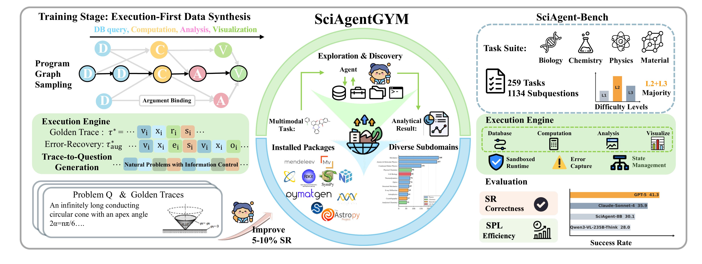
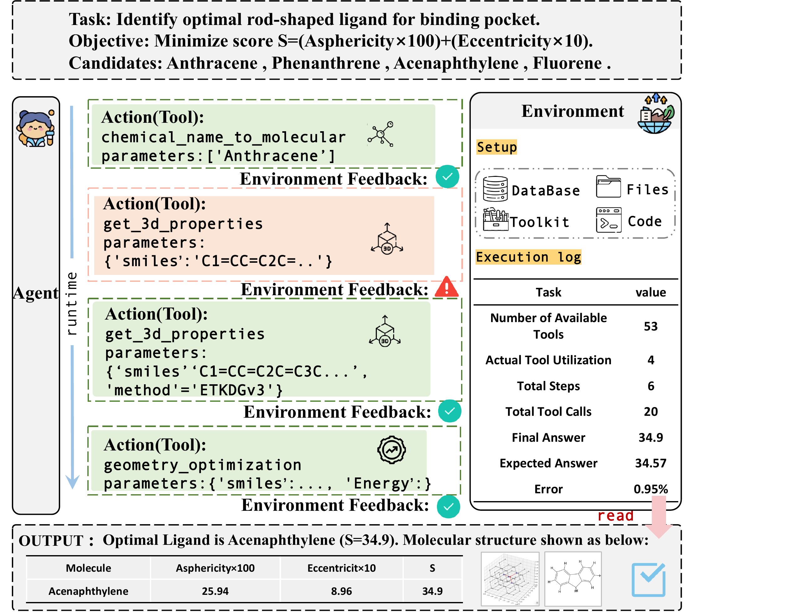
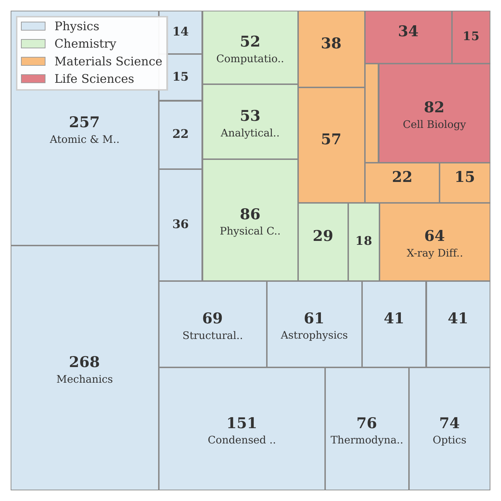
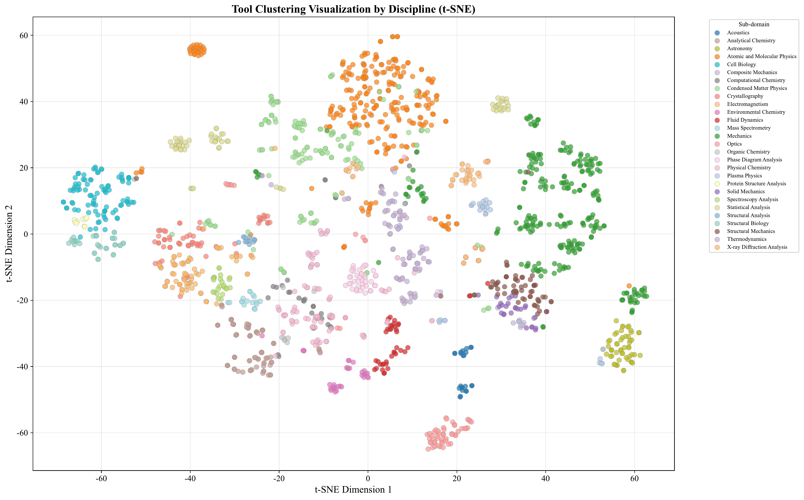
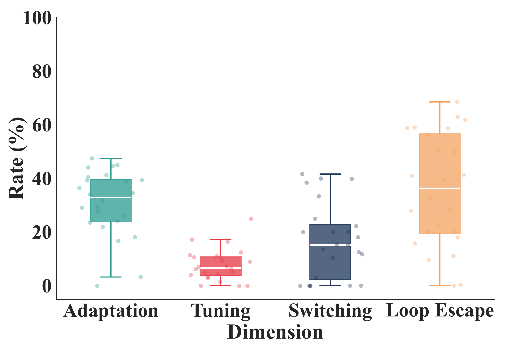

<h1 align="center"> SciAgentGym: Benchmarking Multi-Step Scientific Tool-use in LLM Agents </h1>

<p align="center">
  <a href="#">📃 Paper</a>
  •
  <a href="#">🤗 Data & Models</a>
  •
  <a href="#">🔧 Toolkits</a>
</p>

We present **SciAgentGym**, the first benchmark environment for evaluating LLM agents' capability in multi-step scientific tool-use. SciAgentGym provides a comprehensive suite of scientific tools across multiple disciplines, enabling rigorous evaluation of how well LLMs can solve complex scientific problems through sequential tool invocation.

<p align="center">
  
</p>

---

## Overview

Complex scientific problems often require multiple steps of computation, each involving specialized domain tools. SciAgentGym addresses this challenge by providing:

- **1780+ Scientific Tools** across Physics, Chemistry, Materials Science, Life Science, and Astronomy
- **Multi-step Reasoning Tasks** requiring sequential tool calls to reach final answers
- **Standardized Evaluation Pipeline** with automated answer extraction and scoring
- **Flexible Tool Registration** enabling easy extension to new domains

## Environment Building

SciAgentGym provides an integrated execution environment comprising four components:

| Component | Description |
|-----------|-------------|
| **Toolkit** | 1,780 domain-specific scientific tools across multiple disciplines |
| **Filesystem** | Data storage and artifact management for intermediate results |
| **Databases** | Scientific knowledge retrieval (e.g., PubChem, local molecular DBs) |
| **Python Interpreter** | Flexible computation environment for tool execution |

Each task runs in an **isolated instance** with its own registered tools and filesystem, ensuring reproducibility and avoiding cross-task contamination.

<p align="center">
  
</p>

### Design Principles

- **Type Safety**: Each tool specifies typed input/output signatures enabling automatic validation
- **Reproducibility**: All executions are recorded as structured traces with fixed random seeds
- **Extensibility**: Tools are organized by domain with standardized protocols, enabling researchers to register custom tools for specialized domains

### Tool Distribution

SciAgentGym contains **1,780+ scientific tools from 4 major disciplines**:

<p align="center">
  
</p>

| Discipline | Topics |  Python files |
|------------|--------|-------|
| **Physics** | Optics, Mechanics, Electromagnetism, Thermodynamics, Acoustics, Plasma Physics, Fluid Dynamics, Atomic Physics, Condensed Matter | 96+ |
| **Chemistry** | Analytical, Physical, Computational, Organic, Environmental | 28+ |
| **Materials Science** | Crystallography, Spectroscopy, Structural Analysis, XRD | 24+ |
| **Life Science** | Structural Biology, Mass Spectrometry | 19+ |

<p align="center">
  
</p>
<p align="center"><em>Tool clustering results by discipline</em></p>

## Key Findings

We analyze 6,617 error instances to understand model failures in scientific tool-use:

<p align="center">
  
  &nbsp;&nbsp;
  
</p>

- **Process-Level**: Models show low Adaptation (32.9%), Tuning (6.6%), Switching (15.3%), and Loop Escape (35.7%) rates
- **Recovery Dynamics**: Strong models can escape error loops with a Rise-Fall-Rise pattern; weaker models decline monotonically and remain stuck

## Main Results

Success Rate (SR, %) for **without tools** and **with tools** settings. Δ denotes the improvement from tool usage.

| Model | w/o Tools | w/ Tools | Δ | Phys. | Chem. | Mat. | Life |
|-------|:---------:|:--------:|:---:|:-----:|:-----:|:----:|:----:|
| **Closed-Source** ||||||||
| GPT-5 | 32.3 | **41.3** | +9.0 | 46.3 | **43.8** | 28.6 | **32.3** |
| Grok-4-1 | 30.4 | 40.3 | +9.9 | 47.2 | 38.2 | **32.4** | 30.0 |
| Claude-Sonnet-4 | 22.4 | 35.9 | **+13.5** | 39.4 | 39.5 | 27.0 | 25.0 |
| Gemini-2.5-Flash | 28.5 | 32.7 | +4.2 | 38.3 | 32.4 | 28.6 | 17.2 |
| Gemini-2.5-Pro | 24.8 | 32.6 | +7.8 | 37.3 | 35.1 | 26.5 | 18.8 |
| O3 | 26.6 | 32.0 | +5.4 | 35.5 | 37.3 | 32.4 | 6.5 |
| O4-mini | 27.8 | 31.1 | +3.3 | 31.2 | 35.5 | 30.6 | 20.0 |
| GPT-4o | 17.1 | 18.7 | +1.6 | 21.3 | 20.5 | 8.6 | 16.0 |
| **Open-Source (>30B)** ||||||||
| GLM-4.6V | 26.0 | 30.9 | +4.9 | 30.9 | 37.5 | 22.2 | 18.8 |
| Qwen3-VL-235B-Think | 24.4 | 28.0 | +3.6 | 30.6 | 29.5 | 22.9 | 22.6 |
| Qwen3-VL-32B-Think | 24.4 | 27.9 | +3.5 | 33.0 | 31.2 | 8.8 | 22.6 |
| **Open-Source (≤30B)** ||||||||
| Qwen3-VL-8B-Inst | 18.4 | 23.4 | +5.0 | 24.0 | 28.6 | 7.1 | 24.1 |
| SciAgent-8B | 23.3 | 30.1 | +6.8 | 33.0 | 35.2 | 9.1 | 31.0 |
| SciAgent-4B | 17.4 | 25.2 | +7.8 | 28.4 | 28.4 | 14.7 | 19.4 |
| *Average* | 23.2 | 28.1 | +4.9 | 31.7 | 30.4 | 18.9 | 20.2 |

## Architecture

```
SciAgentGym/
├── gym/                      # Core evaluation environment
│   ├── env.py               # MinimalSciEnv - execution environment
│   ├── tool.py              # EnvironmentTool base class
│   ├── toolbox.py           # Tool registration system
│   ├── agent.py             # Multi-model LLM client
│   ├── test_executor.py     # Test execution engine
│   ├── test_querys.py       # Benchmark entry point
│   │
│   ├── core/                # Core modules
│   │   ├── tool_loader.py   # Dynamic tool loading
│   │   ├── data_loader.py   # Dataset loading
│   │   ├── evaluator.py     # Scoring algorithms
│   │   └── environment_fs.py # Result management
│   │
│   ├── config/              # Configuration
│   └── utils/               # Utilities
│
└── toolkits/                # Scientific tool implementations
    ├── physics/
    ├── chemistry/
    ├── materials_science/
    ├── life_science/
    └── astronomy/
```

## Toolkits Structure

### Directory Organization

```
toolkits/
├── physics/                          # Physics (96+ tools)
│   ├── optics/                       # Optics
│   │   ├── optics_tools_gym.py       # Tool registration module
│   │   ├── optical_interference_solver_204.py
│   │   └── thin_film_interference.py
│   ├── mechanics/                    # Mechanics (37 tools)
│   ├── electromagnetism/             # Electromagnetism (8 tools)
│   ├── thermodynamics/               # Thermodynamics (12 tools)
│   ├── acoustics/                    # Acoustics (4 tools)
│   ├── plasma_physics/               # Plasma Physics
│   ├── fluid_dynamics/               # Fluid Dynamics
│   ├── atomic_and_molecular_physics/ # Atomic & Molecular Physics
│   ├── condensed_matter_physics/     # Condensed Matter Physics
│   └── structural_mechanics/         # Structural Mechanics
│
├── chemistry/                        # Chemistry (28+ tools)
│   ├── analytical_chemistry/         # Analytical Chemistry
│   ├── physical_chemistry/           # Physical Chemistry
│   ├── computational_chemistry/      # Computational Chemistry
│   ├── organic_chemistry/            # Organic Chemistry
│   └── environmental_chemistry/      # Environmental Chemistry
│
├── materials_science/                # Materials Science (24+ tools)
│   ├── crystallography/              # Crystallography
│   ├── spectroscopy_analysis/        # Spectroscopy Analysis
│   ├── structural_analysis/          # Structural Analysis
│   └── x_ray_diffraction_analysis/   # XRD Analysis
│
├── life_science/                     # Life Science (19+ tools)
│   ├── structural_biology/           # Structural Biology
│   └── mass_spectrometry/            # Mass Spectrometry
│
├── astronomy/                        # Astronomy (6+ tools)
│
└── local_db/                         # Local Databases
    └── *.db / *.sqlite               # SQLite databases
```

### File Types

| File Type | Description | Example |
|-----------|-------------|---------|
| `*_tools_gym.py` | Tool registration module with `@Toolbox.register` decorated classes | `optics_tools_gym.py` |
| `*.py` | Core computation function implementations | `thin_film_interference.py` |
| `*.json` | Configuration or data files | `reaction_library.json` |
| `*.db` | SQLite databases for knowledge retrieval | `molecules.db` |

### Tool Class Example

```python
@Toolbox.register(name="calculate_thin_film_interference")
class CalculateThinFilmInterferenceTool(EnvironmentTool):
    """Calculate enhanced and weakened wavelengths in thin film interference."""
    
    name = "calculate_thin_film_interference"
    description = "Calculate enhanced and weakened wavelengths in thin film interference."
    arguments = {
        "n1": {"type": "number", "description": "Refractive index of incident medium"},
        "n2": {"type": "number", "description": "Refractive index of thin film"},
        "d": {"type": "number", "description": "Film thickness in nm"},
    }
    
    def use(self, environment, action) -> Observation:
        result = compute_interference(...)
        return Observation(self.name, json.dumps(result))
```

## Quick Start

**Installation**

```bash
git clone git@github.com:CMarsRover/SciAgentGYM.git
cd SciAgentGym
pip install -r requirements.txt
```

**Configure API Keys**

Edit `gym/config/config.py`:

```python
SUPPORTED_MODELS = {
    "gpt-4o": {
        "provider": "openai",
        "api_base_url": "https://api.openai.com/v1",
        "api_key": "your-api-key",
    },
    # Add more models...
}
```

**Run Evaluation**

```bash
# Run full benchmark
python gym/test_querys.py

# Specify model
python gym/test_querys.py --model gpt-4o

# Run single case
python gym/test_querys.py --case-id 1
```

## Evaluation Pipeline

SciAgentGym provides a standardized evaluation pipeline:

1. **Tool Loading**: Automatically infer and load required tools from metadata
2. **Agent Execution**: LLM generates tool calls, environment executes them
3. **Answer Extraction**: Extract final answer from `\boxed{}` format
4. **Scoring**: Compare against gold standard with flexible matching

```python
from gym.core.tool_loader import prepare_env_from_query
from gym.core.evaluator import extract_boxed_answer, is_answer_correct

# Load environment and tools
env, tools, schema, registry = prepare_env_from_query(test_case)

# Run agent interaction...

# Evaluate
answer = extract_boxed_answer(model_response)
correct = is_answer_correct(question, answer, gold_answer, case_id)
```

## Extending SciAgentGym

**Adding New Tools**

```python
# toolkits/physics/optics/my_tool.py
from gym.toolbox import Toolbox
from gym.entities import Observation

@Toolbox.register
class RefractionCalculator:
    name = "refraction_calculator"
    description = "Calculate refraction angle using Snell's law"
    
    parameters = {
        "type": "object",
        "properties": {
            "n1": {"type": "number", "description": "Refractive index of medium 1"},
            "n2": {"type": "number", "description": "Refractive index of medium 2"},
            "theta1": {"type": "number", "description": "Incident angle in degrees"}
        },
        "required": ["n1", "n2", "theta1"]
    }
    
    def use(self, n1: float, n2: float, theta1: float) -> Observation:
        import math
        theta2 = math.degrees(math.asin(n1 * math.sin(math.radians(theta1)) / n2))
        return Observation(source=self.name, observation=f"Refraction angle: {theta2:.2f}°")
```

## Supported Models

SciAgentGym supports multiple LLM providers:

- **OpenAI**: GPT-4o, GPT-4-turbo, GPT-3.5-turbo
- **Anthropic**: Claude-3.5-Sonnet, Claude-3-Opus
- **DeepSeek**: DeepSeek-V3, DeepSeek-Coder
- **Qwen**: Qwen-Max, Qwen-Plus
- **Google**: Gemini-Pro
- **Kimi**: Moonshot

## 📚 Citation

```bibtex
@article{sciagentgym2024,
  title     = {SciAgentGym: Benchmarking Multi-Step Scientific Tool-use in LLM Agents},
  author    = {...},
  year      = {2024},
  url       = {...},
}
```
